<!DOCTYPE html>
<html lang="pt-br">
  <head>
    <meta charset="utf-8">
    <meta http-equiv="X-UA-Compatible" content="IE=edge">
    <meta name="viewport" content="width=device-width, initial-scale=1">
    <title>4Barz Team</title>
    <link href='http://fonts.googleapis.com/css?family=Varela+Round' rel='stylesheet' type='text/css'>
    <link href="css/bootstrap.min.css" rel="stylesheet">
    <link href="http://netdna.bootstrapcdn.com/font-awesome/4.1.0/css/font-awesome.min.css" rel="stylesheet">
    <link href="css/flexslider.css" rel="stylesheet" >
    <link href="css/styles.css" rel="stylesheet">
    <link href="css/queries.css" rel="stylesheet">
    <link href="css/animate.css" rel="stylesheet">
        <!-- HTML5 Shim and Respond.js IE8 support of HTML5 elements and media queries -->
        <!-- WARNING: Respond.js doesn't work if you view the page via file:// -->
        <!--[if lt IE 9]>
        
        
        <![endif]-->

	<link rel="shortcut icon" href="img/favicon.png">
      </head>
      <body id="top">

        <header id="home">
          <nav>
            

              

                

                  <nav class="pull">
                    <ul class="top-nav">
                      <li><a href="#intro">Apresentação <i class="fa fa-angle-right"></i></a></li>
                      <li><a href="#features">Benefícios da Calistenia <i class="fa fa-angle-right"></i></a></li>
                    <!--  <li><a href="#responsive">Atividades 4Barz <i class="fa fa-angle-right"></i></a></li> -->
                      <li><a href="#portfolio">Links <i class="fa fa-angle-right"></i></a></li>
                       <li><a href="#treinos">Treinos <i class="fa fa-angle-right"></i></a></li>
                      <li><a href="#contact">Contato <i class="fa fa-angle-right"></i></a></li>
                      <li><a id="OpenDialog" href="">História 4Barz <i class="fa fa-angle-right"></i></a></li>
                      <li><a id="OpenConduta" href="">Código de Conduta<i class="fa fa-angle-right"></i></a></li>
                    </ul>
                  </nav>
                

              

            

          </nav>

			<!--

  				

      			   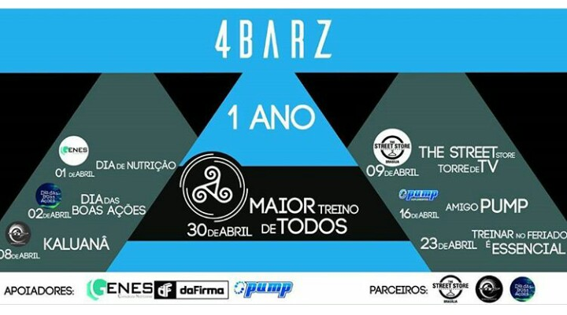
 				 

			
 -->

          <section class="hero" id="hero">
            

              

                

                  <a id="nav-toggle" class="nav_slide_button" href="#"></a>
                

              

              

               

  
				  <!-- -->
                
 
              

              

                

                  <a href="#intro" class="learn-more-btn">#vemser4barz</a>
                
 
              
 
            

          </section>
        </header>
        <section class="intro text-center section-padding" id="intro">
          

            

              

                <h1 class="arrow">Apresentação</h1>
                
O projeto comunitário de treinamento funcional, calistenia e street workout denominado 4BARZ é um Time que tem por finalidade oferecer saúde, qualidade de vida e bem estar a todos os praticantes, tendo como contrapartida o auxílio dos mesmos nas ações sociais e/ou eventos que são desenvolvidos pelo grupo, com a doação de donativos de todos os tipos para serem redirecionados às instituições de caridade e famílias necessitadas.

              

            

          

        </section>
        <section class="features text-center section-padding" id="features">
          

            

              

                <h1 class="arrow">Os benefícios da Calistenia</h1>
                

                  

                    

                      <i class="fa fa-male shadow"></i>
                    

                    <h2>Power</h2>
                    
Corpo é a parte física do ser humano. Na calistenia, trabalhamos e desenvolvemos o corpo humano, promovendo o aumento de força, massa muscular magra, melhor mobilidade, flexibilidade e agilidade.

                  

                  

                    

                      <i class="fa fa-smile-o shadow"></i>
                    

                    <h2>Energy</h2>
                    
Mente é o estado da consciência ou subconsciência que possibilita a expressão da natureza humana. Etimologicamente, o termo vem do latim mèntem, que tem o significado de pensar, conhecer, entender, e significa também medir, visto que alguém que pensa não faz outro que medir, ponderar as ideias. 

                  

                  

                    

                      <i class="fa fa-heart shadow"></i>
                    

                    <h2>Movement</h2>
                    
Alma é a parte considerada como a Sede das Emoções humana. Com os nossos treinos em grupo, trabalhamos no campo da mente ao trazer sensações emotivas como prazer, alegria e companheirismo com nossos parceiros de treino.

                  

                  

                

              

            

          

        </section>
      <!--  <section class="text-center" id="responsive">
          

            

              

                

              

              

            

            

              

                

                  

                    <ul class="slides">
                      <li>
                        <h1 class="arrow">Atividades 4Barz</h1>
                        
Os treinos do 4Barz acontecem todos os domingos no estacionamento 4 do Parque da Cidade (Sarah Kubitschek), às 09h45min da manhã, de forma gratuita, mediante apresentação de atestado médico em teste de aptidão física pré-agendado pelo <a href="http://www.instagram.com/4barz.team">instagram</a> do 4Barz.

                        

                        Uma vez ao mês, também aos domingos, acontece o <b>4Barz Social</b>, quando parceiros e patrocinadores se unem para arrecadar doações, sejam de mantimentos ou vestuário, para ajudar os mais necessitados. 

                        
Estes eventos sociais são abertos ao público mediante doação.

                        
 Maiores informações na sessão <a href="#treinos">TREINOS</a>

                      </li>
                    <li>
                        <h1 class="arrow">Profissionais Bootstrap</h1>
                        
Lorem ipsum dolor sit amet, consectetur adipiscing elit. Nunc ultricies nulla non metus pulvinar imperdiet. Praesent non adipiscing libero. 

                        

                        Mauris ultrices odio vitae nulla ultrices iaculis. Nulla rhoncus odio eu lectus faucibus facilisis. Maecenas ornare augue vitae sollicitudin accumsan. 

                        
Etiam eget libero et erat eleifend consectetur a nec lectus. Sed id tellus lorem. Suspendisse sed venenatis odio, quis lobortis eros.

                      </li> 
                    </ul>
                  

                

              

            

          

        </section> -->
        <section class="swag text-center">
          

            

              

                <h1>A família que mais cresce na cidade  #vemser4barz</h1>
                <a href="#portfolio" class="down-arrow-btn"><i class="fa fa-chevron-down"></i></a>
              

            

          

        </section>
        <section class="portfolio text-center section-padding" id="portfolio">
          

            

              

                <ul class="slides">
                  <li>
                    

                      

                        

                          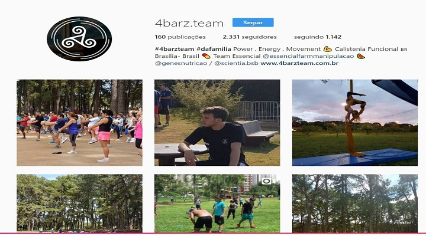
                          

                            <a href="https://www.instagram.com/4barz.team/" class="expand"><i class="fa fa-search"></i> Veja Mais</a>
                            <a class="close-overlay hidden">x</a>
                          

                        

                      

                      <h2>Instagram</h2>
                     <!-- 
Lorem ipsum dolor sit amet, consectetur adipiscing elit. Nunc ultricies nulla non metus pulvinar imperdiet. Praesent non adipiscing libero.
 -->  
                    

                    

                      

                        

                          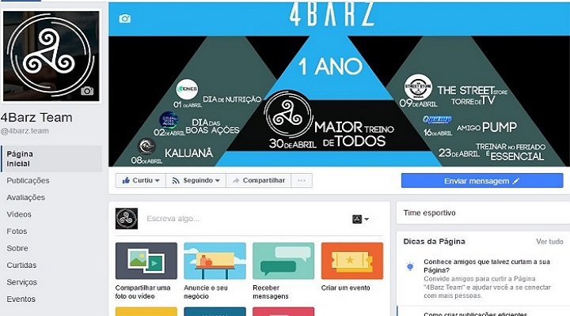
                          

                            <a href="https://www.facebook.com/4barz.team" class="expand"><i class="fa fa-search"></i> Veja Mais</a>
                            <a class="close-overlay hidden">x</a>
                          

                        

                      

                      <h2>Facebook</h2>
                     <!-- 
Lorem ipsum dolor sit amet, consectetur adipiscing elit. Nunc ultricies nulla non metus pulvinar imperdiet. Praesent non adipiscing libero.
 -->
                    

                    

                      

                        

                          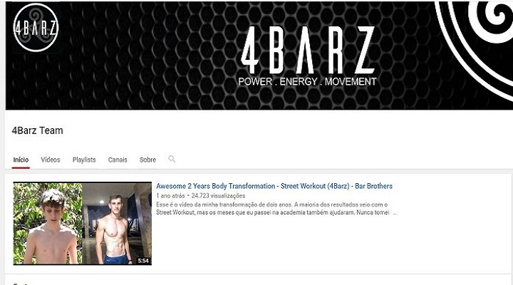
                          

                            <a href="https://www.youtube.com/channel/UCR1RyPCNzBgthQ2TE1OeoqQ" class="expand"><i class="fa fa-search"></i> Veja Mais</a>
                            <a class="close-overlay hidden">x</a>
                          

                        

                      

                      <h2>Youtube</h2>
                    <!--  
Lorem ipsum dolor sit amet, consectetur adipiscing elit. Nunc ultricies nulla non metus pulvinar imperdiet. Praesent non adipiscing libero.
 -->
                    

                  </li>
                  <li>
                   <!-- 

                      

                        

                          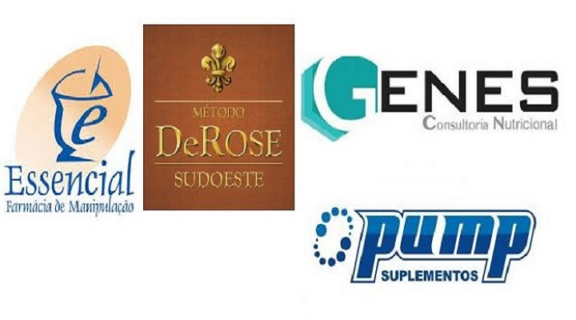
                          

                            <a href="#contact" class="expand"><i class="fa fa-search"></i> Veja Mais</a>
                            <a class="close-overlay hidden">x</a>
                          

                        

                      

                      <h2>Parceiros</h2>
                      
met, consectetur adipiscing elit. Nunc ultricies nulla no
 
                    
 -->
                   <!-- 

                      

                        

                          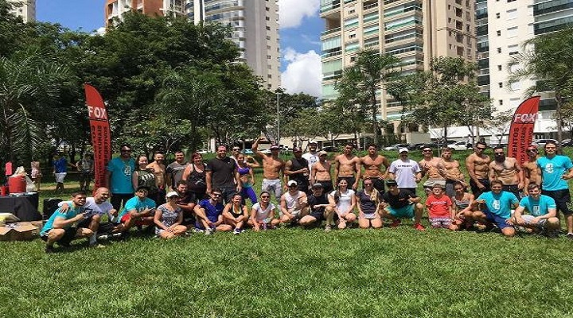
                          

                            <a href="https://www.instagram.com/4barz.gyn/" class="expand"><i class="fa fa-search"></i> Veja Mais</a>
                            <a class="close-overlay hidden">x</a>
                          

                        

                      
 
                      <h2>4Barz Goiânia</h2>
                     
Sede do 4Barz em Goiânia

                    

                    -->
                  <!--  

                      

                        

                          
                          

                            <a href="https://play.google.com/store/apps/details?id=sgk.com.br.sgk" class="expand"><i class="fa fa-search"></i> Veja Mais</a>
                            <a class="close-overlay hidden">x</a>
                          

                        

                      

                      <h2>Aplicativo</h2> -->
                      

 
                    
 
                  </li>
                </ul>
              

            

          

        </section>
         <section class="swag text-center">
          

            

              

              

            

          

        </section>
          <section class="treinos text-center section-padding" id="treinos">
          

            

              

                <ul class="slides">
                  <li>
                    

                      

                        

                          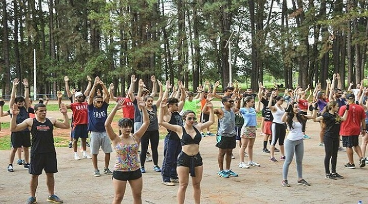
                          

                            <a href="https://www.instagram.com/4barz.team/" class="expand"><i class="fa fa-search"></i> Veja Mais</a>
                            <a class="close-overlay hidden">x</a>
                          

                        

                      

                      <h2>Treinos 4Barz</h2>
                     
Nossos treinos acontecem todos os domingos, às 09h45min da manhã, no estacionamento 04 do Parque Sarah Kubitcheck (Parque da Cidade). Necessário a atestado médico e aprovação em nosso TAF (Teste de Aptidão Física) 4Barz. Venha treinar com a gente!
 
                    

                    

                      

                        

                          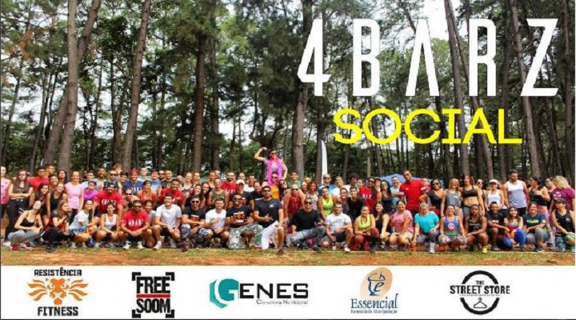
                          

                            <a href="https://www.facebook.com/4barz.team" class="expand"><i class="fa fa-search"></i> Veja Mais</a>
                            <a class="close-overlay hidden">x</a>
                          

                        

                      

                      <h2>4Barz Social</h2>
                     
4Barz Social é um evento que ocorre uma vez ao mês que tem como intuito arrecadar mantimentos, vestuários e etc para alguma instituição escolhida por nós. Conta com a participação de parceiros e patrocinadores do 4Barz, com treinamentos diferenciados e dinâmicos. É aberto a qualquer pessoa, sendo obrigatória a doação. Acontece todos os primeiros domingos do mês.
 
                    

                    

                      

                        

                          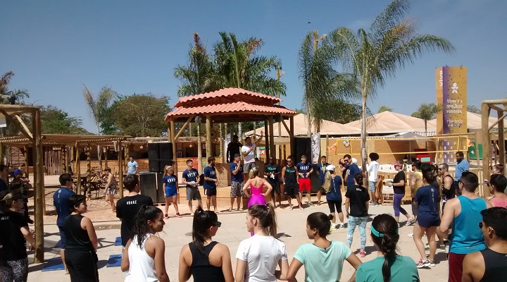
                          

                            <a href="http://www.instagram.com/4barz.team" class="expand"><i class="fa fa-search"></i> Veja Mais</a>
                            <a class="close-overlay hidden">x</a>
                          

                        

                      

                      <h2>TAF 4Barz</h2>
                      
Sua saúde é nossa maior preocupação. Por isto, temos o TAF 4Barz. É um pequeno teste para sabermos se você está apto a treinar conosco. Acontece após os treinos de domingo. Agende conosco pelo direct do nosso instagram (clique <a href="http://www.instagram.com/4barz.team">AQUI</a> ou na imagem acima)
 
                    

                  </li>
 
                </ul>
              

            

          

        </section>
         <section class="swag text-center">
          

            

              

              

            

          

        </section>
		<section class="team text-center section-padding" id="team">
    

    
            

              

                <h1 class="arrow">Mais que um time, uma família!</h1>
              

            

            

              

                

                  <ul class="slides">
                    <li>
                      

                        
                        <h2>Guilherme Assunção</h2>
                        
Fundador e Instrutor 4Barz

                        

                          <ul class="social-buttons">
                            <li><a href="https://www.facebook.com/guilherme.assuncao.148?fref=ts" class="social-btn"><i class="fa fa-facebook"></i></a></li>
                            <li><a href="https://www.instagram.com/guiassuncao.4b/" class="social-btn"><i class="fa fa-instagram"></i></a></li>
                           
                          </ul>
                        

                      

                      
                      

                        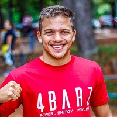
                        <h2>Mateus Chiarini</h2>
                        
Fundador e Instrutor 4Barz

                        

                          <ul class="social-buttons">
                            <li><a href="#" class="social-btn"><i class="fa fa-facebook"></i></a></li>
                            <li><a href="#" class="social-btn"><i class="fa fa-instagram"></i></a></li>
                         
                          </ul>
                        

                      

                      

                        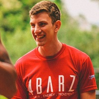
                        <h2>Matheus Erthal</h2>
                       
Fundador e Instrutor 4Barz

                        

                          <ul class="social-buttons">
                            <li><a href="#" class="social-btn"><i class="fa fa-facebook"></i></a></li>
                            <li><a href="#" class="social-btn"><i class="fa fa-instagram"></i></a></li>
                          
                          </ul>
                        

                      

                    </li>
					<li>
                    

                        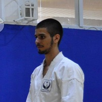
                        <h2>Leonardo Assunção</h2>
                       
Fundador e Tecnologia

                        

                          <ul class="social-buttons">
                          <li><a href="https://www.facebook.com/leoassuncao" class="social-btn"><i class="fa fa-facebook"></i></a></li>
                            <li><a href="https://www.instagram.com/leooassuncao" class="social-btn"><i class="fa fa-instagram"></i></a></li>
                          </ul>
                        

                        

                         

                        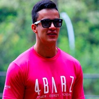
                        <h2>Luiz Oliveira</h2>
                       
Instrutor 4Barz

                        

                          <ul class="social-buttons">
                 
                          
                          </ul>
                        

                      

                      
                  </ul>
                

              

            

          

        </section> 
<!--
        <section class="subscribe text-center">
		

            <h1><i class="fa fa-paper-plane"></i>Saiba das Novidades</h1>
            <form action="#">
              <input type="text" name="" value="" placeholder="" required>
              <input type="submit" name="" value="Enviar">
            </form>
          

        </section> -->

        <section class="dark-bg text-center section-padding contact-wrap" id="contact">
          <a href="#top" class="up-btn"><i class="fa fa-chevron-up"></i></a>
          

            

              

                <h1 class="arrow">Contate-nos</h1>
              

            

            

              

                

                  <h2><i class="fa fa-map-marker"></i>Endereço</h2>
                  
Estacionamento 4 - Parque da Cidade - Brasília/DF

                

              

              

                

                  <h2><i class="fa fa-mobile"></i>Telefone</h2>
                  
+55 61 99616-9934

                

              

              

                

                  <h2><i class="fa fa-paper-plane"></i>E-mail</h2>
                  
<a href="#">4barz.team@gmail.com</a>

                

              

            

           <!-- 

              

                <ul class="social-buttons">
                  <li><a href="#" class="social-btn"><i class="fa fa-dribbble"></i></a></li>
                  <li><a href="#" class="social-btn"><i class="fa fa-twitter"></i></a></li>
                  <li><a href="#" class="social-btn"><i class="fa fa-envelope"></i></a></li>
                </ul>
              

            

          
 -->
        </section>
        <footer>
          

            

              

                <ul class="legals">
                <!-- TODO: LOGO DOS PARCEIROS -->
                 <li>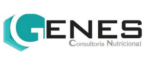</li>
                 <li>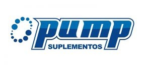</li>
                 <li></li>
               <!--  <li></li> -->
                 <!--<li>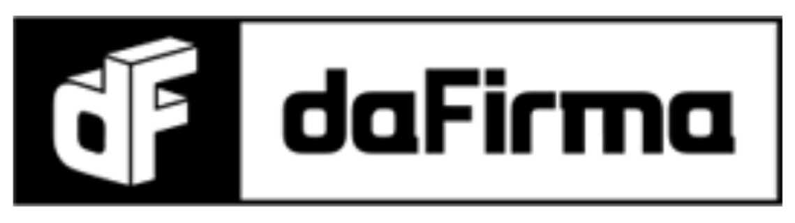</li>-->
                </ul>
              

              
            

          

          

            

              

                <ul class="legals">
                  <li><a>Design por <a href="https://www.linkedin.com/in/leoassuncao/">Leonardo Assunção</a></li>
                  <li><a>2017</a></li>
                </ul>
              

              
            

        </footer>
        <!-- jQuery (necessary for Bootstrap's JavaScript plugins) -->
        
        <!-- Include all compiled plugins (below), or include individual files as needed -->
        
        
        
        
        
        
        
        

      </body>
    </html>
